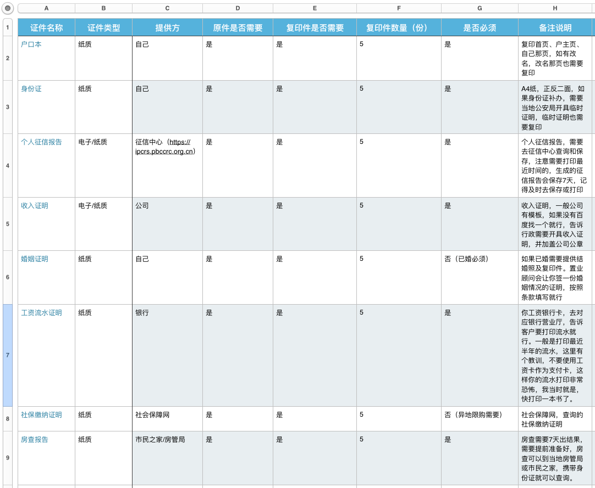

# 买房建议

```
1.没有十全十美的，有的是取舍之后比较合适的房源
2.明确买房的目的，是刚需还是投资或是二者兼有
3.兼听则明，获取各方面的信息
4.不要相信开发商，置业，第三方平台或组织，自媒体的宣传和忽悠，实际去看，以实际落实为准或写到合同的为准
5.不要贪小便宜，没有免费的午餐
6.各种合同一定要仔细看清楚，特别是自己的权益，开发商或物业的责任和义务
7.既买之则安之，既然在买了某房源就不要在人前经常抱怨，可以给开发商或者置业顾问提意见
```

# 如何买一个好房子

买房指标
1、须重视：楼间距与南北向

相邻楼之间的距离越大，居住品质就越高，私密性也会更好，但是很多楼盘的沙盘模型并不会呈现实际的楼间距，所以，要提前咨询清楚。

2、易混淆：绿地率和绿化率

现在你去看房的时候，都会有两个概念：绿化率和绿地率，一般小区的绿地率是不能低于30%，但是有很多的开发商都是用“绿化率”，因为这个绿化率的计算是很模糊的。


3、须了解：进深

一般来说户型的进深都在12米之下，这样的是相对比较合理的，一般来说，板式楼层或小高层的进深在10-12米之间是合理的。

4、最相关：得房率和公摊面积

一般多层的得房率是80%会高于高层的70%，因为高层都会被电梯间和通道面积占用。得房率越高越好，但公摊面积太小，舒适度就减低，电梯空间狭小，楼道也不舒适。

一般而言，高层的公摊大于多层的公摊，所以对于这个比较介意的需要注意了。

5、不忽略：车位比

一般而言，小区车位比在1:0.6还算可以，不能再低于这个比例了，这关系到了以后入住后买车停车的问题。

6、要计算：赠送面积

现在为了房产销售冲量：很多的开发商都会在原有基础上赠送一些面积，比如：送阳台，阳台分封闭和半封闭两种，封闭阳台是全面积，而半封闭是面积的一半，所以半封闭阳台越来越多。

7要注意：层高

一般现在商品房的层高是2.9m扣掉减去楼板和地砖的厚度，有2.7m就是属于正常的，而如果要买跃层或者复式的话，层高的指标就更加重要了。

8、最常见：容积率

对于你入住后的小区舒适度，那么容积率就是关键了，容积率越低，舒适度就越高，一般情况下高层的容积率不超过5，多层住宅不超过3.


9、要关注：开间

这里说的开间就是讲的采光面，所以越开阔越好，一般来说，两室一厅80平左右的住宅，其客厅开间不可以超过3.9m，而面积再大一些的住宅最好也不要超过4.2m。

另外 小区的物业 开发商也需要重点关注

--------


# 房屋的类型 

A 房子类型：我们可以按照年限简单把房子划分为，新房和二手房。  

B [用地性质](https://baike.baidu.com/item/用地性质/7418473?fr=aladdin)：
开发商会在从当地政府手里购买一块或多块土地，用来修建小区或者其他用途，开发商购买的土地，
根据使用的方式和目的，可以分为多种，如果开发商没有安装国家规定使用土地，那么修建的小区或者其他主体就是属于违建，
大家可能知道一些商用地后来修建小区或者修建别墅，这些都属于违建，很大程度是拿不到房产证的，
拿不到房产证如果是自住还好，如果考虑交易那就不行了，二手房交易之前中介必须拿房产证做担保的。 

C 同时小区按照开发目的可以分为几种，居民楼，单位小区，开发商新建的小区，回迁小区。  
居民楼：上世纪六十年代，国家统一修建的小区。优点是公摊小，便宜；缺点是结构紧凑，产权复杂，居住人多。  
单位小区：企业给员工分配的房子，一般是国企或者较大的私营企业。优点是物业环境好，建筑质量相对较好，
人员结构单一，学区优秀；缺点是公告空间小，车位不足，房源紧缺。  
开发商新建的小区：开发商修建的商品房小区。优点是市场主流，库存主力，房源多，房子年代比较新，
配套相对比较齐全，设计理念较新进，安保比较好。缺点是捆绑装修和物业，各种附加费用较高，房屋质量一般。  
回迁小区：大城市由政府集中修建一些小区，用来安置城市被拆迁户，这些小区一般都会承包给开发商，
由开发商顺便建一些商品房来补贴利润。优点：单价便宜。缺点：质量问题严重，小区配套不齐全 ，各种奇葩问题，千万不要买回迁房。  

D 房屋的按照建筑的结构和设计，分为板楼，塔楼。板楼和塔楼各有自己的特点，现在开发商大多采用这二种建筑结构和设计。  
[板楼](https://baike.baidu.com/item/板楼/10988345?fr=aladdin)：板楼是对建筑结构的构筑物的称呼，
板楼一般建筑层数不会超过12层。板楼优势是户型规矩，通风日照好。  
[塔楼](https://baike.baidu.com/item/塔楼/1874)：塔楼是对不同建筑结构的建筑物的称呼，
塔楼一般是指高层建筑。优势是建筑密度较高，房价较低，空间结构灵活，易于改造，结构强度高。  

E 住宅类型：国内住宅大概有八种类型，分别是单元式住宅，公寓式住宅，洋房住宅，独栋住宅，跃层式住宅，复试住宅，
退台式住宅。我们一般选择是单元式住宅，这里不仔细说明各个住宅类型，感兴趣的可以[查看链接了解]
(http://gz.leju.com/news/2016-07-01/15546154552514642755710.shtml?wt_source=newshp_news_06)。

## 购房资格和资料


1.购房资格审查
	A 购房资格核验：有二种方式，一种是线下的查询；另外一种是线上查询。
	线下查询需要去<武汉房产管理中心>查询，时间大概是一天左右。    
	线上查询，主要通过查询社保情况来，可以通过所在城市的的劳动保障网或者社会保险业务网站，输入你的身份证号码和密码进行查询。
	
	B 户口户籍所在地：因为楼市高涨，各地政府出台了限购政策，有很重要的一条限制就是当地户口。
	比如，北京户口在北京可以购房，非京户需要交满社保，还需要办理工作居住证等条件才行。
	
	C 产权查询：产权查询主要目的是搞清楚自己是首套还是二套，有些地方首套可以买，二套需要等待一定年限才能再次购买。
	
	D 贷款：查询自己有没有商业贷款，如果购房需要再次贷款，银行会查询你的贷款记录，
	这会影响银行是否允许贷款，也会影响放款及放款时间。
	
	E 限购和社保：限购就是各地方政府为了避免大规模炒房，出具的一些限制购买政策，
	对于新房一般有限制户口和社保缴纳二种方式，对于二手房有限制年限出售（只有买多少年才可以再卖）。
	
2.购房资料准
	新房购买需要不少的资料，最好提前准备好，不然到时候再去收集就会有点紧促。（特别是对于在异地工作的朋友）
	一般情况是，在你选择好楼盘之后，该楼盘的销售或者置业顾问会告诉你需要什么资料，
	对于新房各个楼盘的资料基本都是一样的，具体的资料内容如下：




## 选房


1·选房步骤
经历 选房是一个比较漫长的过程，主要的原因有二大点，第一，房子的价值和压力来看，房子的价格很贵，对于普通家庭而言可能
需要倾尽全家之力，而且后面还有高额的商业贷款和及利息需要偿还，因此会很慎重去挑选，货比多家；第二，房子作为商品本身很复杂，房子有很多属性，
怎么选择合适的房子，需要时间去了解和权衡。当然这二点还是建立在明确知道购房的目的和具体需求的前提下，而且我们面对很多的选择会犹豫。
我当时选择的时候，一开始选择是二手房，后来实际看过发现武汉二手房市场价格倒挂，因此果断放弃二手房，选择新房，当然在选房的时候，我是倾向自住的
因此自住的大条件下，我会考虑居住环境，交通情况，教育，医疗情况，居住舒适性，绿化，以及工作机会。依据工作机遇这个标准，通过一段时间了解和对比
武汉各个地区发展和规划，我知道未来光谷将作为武汉一个新的发力点，而且我从事的计算机行业，在光谷公司比较多，因此大的区域，我定在光谷附近。
我接下来，把光谷作为中心，主要区域有光谷中心，光谷西，光谷北，光谷东，光谷南，然后根据自己的经济条件，筛选之后只留下光谷北，光谷东，光谷南，
这在三个区域基础上，我又选择了一个备份区域青山区，这个备份区域的目的是特别靠近家里，方便照顾父母。
选好区域下面就是选小区或楼盘，我当时是四个区域，从网上分别找出三个最满意的楼盘以及一个备选楼盘，把各个楼盘属性标注好，
然后打电话或者联系销售了解实际情况。	


总结 关于选房我上面写得比较笼统，下面我条理、详细的进行说明选房的步骤。  
选择城市=>选择区域=>选择小区/楼盘=>选择楼栋=>选择楼层=>选择户型=>选择朝向=>其他筛选条件（采光，通透，绿化等）
A 选择城市：首先你需要明确自己在哪个城市买房，在选择的城市有没有购房资格。

B 选择区域：选择城市之后，选择你想在城市那个区域买房，选择区域需要进度多方位考虑，主要的参考标准以下几点，
价格，交通，教育，医疗，就业，发展规划，生活便利，居住人群。

C 选择小区/楼盘：选择好区域，接下来就是选择心仪的楼盘，在选择楼盘的时候，有几个小技巧，首先尽量选择知名的大开发商楼盘（品质，质量相对会好一些）；
其次选择大型社区楼盘（出问题维权人多）；再次选择楼盘之后不要只听开发商或销售吹牛逼瞎逼逼，如果有前几期业主群，想办法进群里，了解楼盘真实情况，
我当时通过评论和业主论坛，评论多水军，论坛大多是负面的消息，这时候你要擦亮眼睛了，分辨那些情况是真是假，影响如何；
再次选择物业服务好的，想想你房子要住好几十年，物业要是不好，很痛苦的，当然物业是可以换，那也是非常麻烦的；
最好选择交通方便的，不管是平时上班还是出去玩，如果小区交通稀烂 ，你所有的兴致都会没有的，只能宅在家里，想想过年过节中国高速的场景，你不想每天都
面对吧，工作已经很累了，每天好几个小时的通勤时间，真的很痛苦。时间就是金钱，利用多出的时间，你可以创造更多的价值和财富。

D 选择楼栋：一个小区或楼盘，一般会有很多栋楼，这个时候楼盘的外在环境基本都是一样的，但是不要小看楼栋选择，不同楼栋住着可能完全是二个小区好嘛。
这里楼栋会涉及到，采光，通透，周边环境，防晒防雨。
a 采光指的是，楼栋整体朝向影响光照，合理小区设计楼栋间距和分布都会考虑光照；我见过一个总层高四十层，三十几层，没有光照的，真是可怕。
b 通透指的是光照和通风大家往往听说的，南北通透，说的是，太阳光可以从一边照射到另外一边，打开窗户空气或风，可以从一边流通或吹到另外一边；    
c 周边环境说的是相关的生活设置，比如超市，垃圾堆，车库，幼儿园，绿化，噪音等，想想如果你家楼下有个垃圾堆，每天进出你心情会很糟吧，
更可怕的是夏天，异味，蚊虫，苍蝇等，其他条件类似的，你都要考虑；
d 防晒防雨，南方或者沿海城市需要特别注意，因为夏天或雨季，如果楼栋不好，会比较热或者容易渗水漏水。我一个装修的朋友告诉我，渗水漏雨基本很难根本
解决，只能管一段时间，现在开发商一般会做，隔热防雨的保护，你需要找置业顾问了解具体的材料和类型，现在材料都是有使用寿命和年限。同时在收房之前，
开发商基本都会做渗水实验，收房的时候需要注意去看。

E 选择楼层：关于选择楼层，有三点需要考虑的，第一是楼层数字，是否有不吉利的数字；第二是楼层光照通透；第三是粉尘、噪音、蚊蝇；第四是视野；
a 楼层数字：我们国家是比较迷信的，带有不吉利数字的楼层大家都不想选，比如四，十三，十八等，有些小区或写字楼为了避免这些楼层，
我见过没有四层的小区，三层上去是五层，还有小区比较奇葩，电梯和楼层不对应，过年去亲戚家拜年，说好是十八层，电梯十八层出去标示是十五层，
开始我以为是避开了不吉利数字楼层或者有地下，然而事实是都不是。如果大家不介意楼层数字，其实选择带有四数字的楼层，是有好处的，可能价格相对
会低一些，抢的人少一些，相对来说好买一点，
b 光照通透，低楼层一般中间户都会是暗室，通风性也比较差，楼栋分布不好，底层边户可能也会比较暗，整体光照时间很短，通风会比中间户好一些。
我个人建议，自住尽量不要买低楼层（平均层高三十，十层以下为底层），白天在家里也要开灯，电费也是money，
当然底层也不是一无是处，首先价格相对会低不少，其次出进比较方便，不需要电梯，高层电梯坏了爬楼梯也是很痛苦的，最后低层没有水压问题比较安全。
c 粉尘、噪音、蚊蝇，低层粉尘比较大，噪音比较严重（特别是靠近马路），蚊蝇相对多一些。
d 视野，如果楼间距大，视野还行，可以看到窗外的景色，如果楼间距很近只能看到对面的墙，高层视野比较开阔，如果没有楼栋阻挡，站阳台往前看，
视野很开阔，有种一览纵山小，君临天下的感觉（意淫），如果有小区附近有湖或者公园，景观视野就更好了。

F 选择户型：开发商会根据不同业主需求，按照功能分区和大小修各种户型，判断户型可以简单通过几室几厅来判断。
选择什么户型，也可以根据自己，未来居住几口人来定（投资就按照自己经济情况买吧，这里不做说明，毕竟大多数人买来是住的），
我这里说三个比较经典的户型：
一室一厅一卫户型：这种属于给单身或者情侣住刚好，非常简单和紧凑，一个卧室+一个客厅+一个厨房+一个卫生间，生活所需空间和功能基本满足；
二室一厅一卫属于标准户型，二个卧室+一个客厅+一个餐厅+一个厨房+一个卫生间，夫妻二人主卧+老人或者孩子次卧，刚刚好，其他功能分区也是完整；
三室二厅二卫/三室一厅一卫属于改善户型，三个卧室+一个客厅/二个客厅+一个餐厅+一个厨房+一个卫生间/二个卫生间，夫妻二人+老人+小孩，功能分区完善。

G 选择朝向：房源朝向一般都是固定好的 ，具体要看开发商有那几个朝向的户型，这里我可以简单介绍几个典型的朝向户型。
西北朝向：朝南采光是朝南采光是受到影响的，除非楼层买高，当然他应该可以看到中央景观；
东北朝向：由于东南受到南方及对面小区的影响，采光也会受限；
东南朝向：两边临街，噪音较大，且如果对街东侧小区楼层高于你，在风水上，这个是忌讳；
西南朝向：从景观、位置、采光来说，都是最理想的选择，也是整个小区内的理想位置之一。
选择顺序：西南套>西北套>东南套>东北套

H 其他筛选条件：请查看下面选房内在要素和外在要素。


2.选房的内在要素
我把房子的自身相关的属性称之为内在要素，房子的本身的要素很多，在选房的时候需要特别注意这些属性，
因为这会决定你所买房子的质量、舒适性、安全性、功能性等标准，我这里列举一些房子比较重要的属性给大家作为参考。
A 价格：一般指的是单价，每平米多少钱，价格一般是毛坯房价格，不过现在武汉基本都是捆绑装修，价格可能包含二部分：毛坯和装修。
eg：13450元/m2  12345元/m2 (包含装修2500元/m2)

B 面积：国内买房标注的面积指的是建筑面积，它包括二个部分，套内建筑面积和公摊面积，并且这二个面积的数据会在你的房本中体现。
建筑面积：房子面积+墙的面积 ，两个房子挨着，那么墙只算一半。
套内面积：全名套内建筑面积，有三部分组，成套内使用面积+套内墙体面积+阳台建筑面积。
公摊面积：由整栋楼的产权人共同所有的整栋楼公用部分的建筑面积。包括：电梯井，管道井，楼梯间，垃圾道，变电室，设备间
、公共门厅、过道、地下室、值班警卫室等。
公摊面积写入房本的依据有三点，第一基于购房人和开发商签订的商品房买卖合同的约定；第二基于法律规定；
第三基于房屋建成竣工验收时测绘单位对小区的测绘。这三点完全可能不一致，房本一般主要看第三点，
这会导致小区得房率不一样。

C 得房率：指可供住户支配的面积与每户建筑面积之比。一般多层的建筑物得房率为88%，高层的建筑物得房率为72%，而办公楼为55%。
得房率太低或者太高都不好，太低可能小区比较小，楼栋间距比较小，会比较压抑，采光也会有影响；太高的话就有点不实惠，买的都是公摊面积
比较坑爹，因此得房率适中是比较好的。
得房率=套内建筑面积/套型建筑面积
套内建筑面积=套内使用面积+套内墙体面积+阳台面积
套型建筑面积=套内建筑面积 +分摊的公用建筑面积（俗说“公摊面积”）

D 公摊率： 房屋公摊率是指房屋公摊面积占房屋总面积的比率。对于公摊面积的处理，目前我国尚无明确法律法规出台，
因公摊面积的不明确，使其成为房地产交易过程中争论的焦点。公摊率主要用于计算在住宅小区之中公用建筑设施
（配电房、楼道、电梯井、公用通道、消防设施以及其他公用设施）在小区总建筑面积之中所占比例。
公摊率=总公摊面积/总建筑面积


E 建筑类型：这个之前在房屋类型介绍过，现在主要的有塔楼和板楼二种类型。

F 楼层：房源所在的楼层数，通常分为低，中，高三个级别。这个在选房源里面，选择楼层也是有介绍的，
低层和高层各有优缺点，需要按照自己需求进行选择。

G 朝向和位置：房屋朝向指的房子采光面最大的地方；位置指的是房子的位置是在当前楼层平面的边上，
还是中间位置。朝向和位置在上一节，选择房源中有具体介绍。

H 户型：户型就是住房的结构和形状。在户型这个问题上，需要注意的是户型只是做了功能分区，各个功能分区布局可能会不一样，
具体各个分区的布局是怎么样的，这个不同楼栋或楼盘都可能不一样，需要实地去看。
我举个例子，小米和小明都是买的三室二厅一卫的户型，小米的卫生间正对着客厅或者餐厅，这是很不好的布局；
小明卫生间布局很好，而且做了干湿分离。这个在选房的户型里面也有具体介绍，请参看上面内容。

I 层高：层高顾名思义说的是一层楼的高度，专业术语是住宅高度以“层”为单位计量，
每一层的高度国家在设计上有要求，这个高度就叫层高。它通常包括下层地板面或楼板面到上层楼板面之间的距离。
国家规定一般住宅建筑层高参数为，2.6-3.5米。武汉层高2013年10月起，从2.8米调整为3.2米。
层高不达标的主要影响有三点，第一空间高低对人精神感受的影响，太矮住着会压抑；第二采光和通风会有影响；
第三装修会受到影响。层高很重要，其他质量问题，可以弥补，层高没法弄，只能整栋楼拆了重建。

J 飘窗和赠送面积：飘窗是怎么样的，我就不解释了，估计大家脑中都有形象的图像。
赠送面积指的是不计入房屋总面积，由开发商赠送的建筑面积，多是飘窗，阳台之内的。
一般开发商为了宣传，会提出二个噱头，一个是赠送面积，一个是飘窗，在大多时候这二个东西是重合的，
赠送的可能就是所谓的飘窗。不知道为什么大家好像比较喜欢飘窗（可能电视剧看多了，这里我要一巴掌把你拍醒），
梦想早上从飘窗照进卧室的阳光唤醒，雨天在飘窗上凭栏观雨，但是事实是飘窗对于大多数的户型来说，有点鸡肋，
因为现在高层住宅设计大多都比较紧凑，卧室本来使用面积就不大，再来个飘窗比较占地方，而且也不好搞装修，
还有城市的年轻人平时都在上班，没有那个闲情雅致，一般太阳还没出来就要起床了，观雨就更奢侈了。
这里给大家建议是，不要听销售和开发商忽悠，一定要实地去看看，赠送面积和飘窗到底是怎么样的，尽量考虑
以后装修，家具怎么摆放，面积是不是够用。我见过主卧面积很大，但是加上所谓的飘窗，摆个床显得非常挤的。

K 水、电、天然气：水是生命之源，日常生活中，水有二种功能，饮用和使用，说通俗一点就是用了喝的加上用来洗衣服做饭之类的。
房屋水有三点需要注意，
a 第一是供水公司和方式，一般小区会跟当地供水公司商议好，统一进行供水。不过有的小区供水不行，
水完全不能用，就不谈饮用了，这个我真见过，有个小区的供水有问题，水龙头放的水都是黄的，完全没法用；
b 第二是房屋出水口布局和数量（水龙头），一般小区装修之前，水管会走一部分，装修可以根据具体需求，增加出水口，
如果装修后再弄就非常麻烦了，所以一定要规划好，厨房，卫生间，洗衣机的出水口都要提前留好。
c 第三是下水口（卫生间马桶，地漏等），这些也需要提前留好 ，后期再改非常麻烦。

电：现代家庭生活很依赖电，各种电器都离不开电，每年电费也是不小的一笔开支，对于电也有二点需要注意的事项：
a 用电的类型：用电类型一般有民用电和商用电二种，民用电比商用电便宜一点，别看只便宜一点，日积月累差距就
  比较客观了。
b 插座的布局和数量：一般家用电器都需要通电才可以使用，这就需要考虑好你需要的电器以及那个地方需要插座，
这个问题在厨房特别需要留心，厨房电器是相对比较多的，一定要提前规划留好足够的插座，多了不怕，少了再加
比较麻烦。   

天然气：现在小区基本都有入户的天然气，天然气成为小区的主要燃气。天然气使用中有二点需要注意：
a 天然气的安全使用，天然气一般不会暴露在外面，因为长时间的风吹日晒，管道可以出现龟裂问题；
b 天然气出口布局和数量，天然气一般在厨房用，一般用来做饭，天然气也可以用来作为热水器的燃料，
做饭需要几个燃气口，是否使用天然气的热水器，这些也是需要提前规划和考虑好。


L 装修：现在买新房都会捆绑装修，开发商的装修质量和风格一直是被诟病的。装修有三点我们需要关注的，
a 首先我们需要明确，是否捆绑装修，这一点很好解决，直接看或者问开发商是否
有装修，个人认为如果不是着急住，买毛坯会比带装修的好，有二点原因，第一是毛坯价格便宜很多；
第二是装修是一个折旧的过程，装修风格一直在变，装修好不住，装修的价值一直是被浪费的；
第三是装修标准和质量不过关，开发商的装修标准往往不会很明确，质量基本也达不到同等价格的要求。
b 其次是装修标准,开发商为了赚装修的差价，现在都会捆绑装修。武汉对于捆绑装修的价格也有明确的标准，
一共分为五个价格区间，分别是：
备案均价不超过10000元/平方米的，全装修价格不高于2000元/平方米；
备案均价15000元/平方米以上，不高于20000元/平方米的，全装修价格不高于3000元/平方米；
备案均价20000元/平方米以上，不高于25000元/平方米的商品住房，全装修价格不高于3500元/平方米；
备案均价25000元/平方米以上，不高于30000元/平方米的商品住房，全装修价格不高于4000元/平方米；
备案均价30000元/平方米以上的商品住房，全装修价格不高于5000元/平方米。
装修价格标准是一方面，另外是装修质量标准，开发商往往会给出一个清单，有哪些装修项并且使用材料是什么样的等，
这里一定要仔细看清楚，装修好了再去改就非常费劲了而且费钱。开发商有个套路就是会在装修里面提，某某同档次的品牌
这里就可以做文章，同档次这个根本不好界定，开发商就可以从中赚取。因此捆绑装修往往达不到同等价格的品质，

M 门窗：购买之前一般会有户型图或者效果图，需要根据这些图，去了解确认门窗布局和数量。如果有装修，需要看门窗
装修使用的材料。


3.选房的外在要素


## 实地看房

## 抢房

```
1.认筹申请
2.置业顾问协商
3.茶水费/火锅费/其他服务费
4.认筹款
5.摇号/网络抢房
```

## 定房

```
1.要or不要
2.贷款or全款
3.捆绑精装修
4.购房合同
5.首付款
6.公积金or商贷
7.贷款银行和贷款利率
8.还贷方式
9.贷款合同
```

## 其他手续

```
1.购房合同领取
2.物业服务合同
3.购房发票和公积金提取
4.房奴,每月定时还款
5.待续
```

## 武汉买房的一些现象

```
1.茶水费
2.捆绑装修
3.捂盘
4.自贸区
5.光谷
6.长江新城
7.四新
```